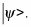

# Citeproc {#sec:implementation}

 @md21 brings these examples. 
This markdown section renders references [@md21]  or [@ndm06;@iaea] and links [x](#qq1) and [sections](#equations)  if you generate [^fn] with:

	pandoc --citeproc -s Docs6+meta.yml  -N  --bibliography=Docs1+MD+Bib.bib  -o main.pdf Docs6+FigSec.md  
	# i.e. without --natbib

[^fn]: see we called without --natbib (footnote)

 
 
{#fig:scatter-matrix}

# CrossRef

 The following will be linking  [@sec:implementation] and  [@fig:scatter-matrix] only if you render with Cross-Ref   :
 
     pandoc -s  Docs6+meta.yml -N -F pandoc-crossref  -C  Docs6+FigSec.md  -o  outputs/Docs6+FigSec.pdf  # no natbib , C after F

# equations

using math and \today   for dates

$$
f(a)={\frac {1}{2\pi i}}\oint _{\gamma }{\frac {f(z)}{z-a}}\,dz
\tag{q1}
\label{qq1}
$$

with alpha beta in utf and latex colors

$$
\newcommand{\positive}{\color{blue}}
\newcommand{\negative}{\color{red}}
{\positive α} {\negative -β}, \quad ∀α,β>0
$$

## Other notes

	pandoc -s  --citeproc --natbib  Docs6+meta.yml  -N  --bibliography=Docs1+MD+Bib.bib  -f markdown -t latex+raw_tex -o main.pdf Docs6+FigSec.md  
    pandoc -s  --citeproc --natbib  Docs6+meta.yml  -N -t latex -o main.pdf Docs6+FigSec.md   
    pandoc -s  --citeproc --natbib  Docs6+meta.yml  -N -t html5 -o main.htm  --mathjax   Docs6+FigSec.md   

or embedded

     pandoc -s  --citeproc --natbib  Docs6+meta.yml  -N -t html5 -o main.htm  --mathjax     --self-contained   Docs6+FigSec.md   
     pandoc -s  --citeproc --natbib  Docs6+meta.yml  -N -t latex+auto_identifiers+smart -o main.pdf Docs6+FigSec.md   
     pandoc --list-extensions=latex

or  after installing haskell crossref from github ( Important: in some environments natbib wont create the refs )

    pandoc -s   Docs6+meta.yml  -N -F pandoc-crossref --citeproc  Docs6+FigSec.md   -o main.pdf   # no natbib for pdf
    pandoc -s Docs6+meta.yml  -N -F pandoc-crossref --citeproc  Docs6+FigSec.md  -t html5 -o main.htm  --mathjax     --self-contained   

	pandoc -s --template  Docs6+tplt.tex     Docs6+meta.yml    # example to see authors from yaml 

# References
 
 
